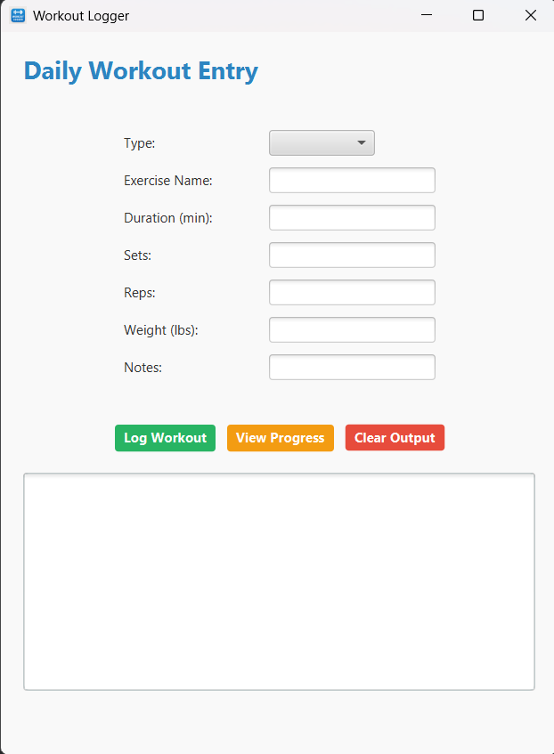

# WorkoutLoggerApp

## Overview
The Workout Logger App is a JavaFX desktop application that allows users to log daily workout sessions, including type, duration, sets, reps, weight, and notes. The app saves workout data using serialization and provides progress tracking with a weekly summary.

## Features
- Log workouts with type, sets, reps, duration, and notes
- Save/load workouts automatically using serialization
- View weekly progress summaries
- Clean UI styled with CSS
- Color-coded action buttons (Log = Green, Progress = Orange, Clear = Red)
- Built with JavaFX

## Screenshot

### Main GUI


## How to Run

1. Ensure you have **Java 17+** and the **JavaFX SDK** installed.
2. Clone or download the project.
3. Open the project in **IntelliJ IDEA**.
4. Run `WorkoutLoggerApp.java`.

## Creating a Runnable JAR

1. Go to `File > Project Structure > Artifacts`.
2. Click the `+` icon > `JAR > From modules with dependencies`.
3. Choose the main class: `workoutlogger.WorkoutLoggerApp`.
4. Select **Extract to the target JAR**.
5. Set the output path (e.g., `WorkoutLoggerApp.jar`).
6. Click OK, then go to `Build > Build Artifacts > Build`.

## Running the JAR

From your terminal or command prompt:
```bash
java --module-path /path/to/javafx-sdk-XX.X.X/lib --add-modules javafx.controls,javafx.fxml -jar WorkoutLoggerApp.jar
